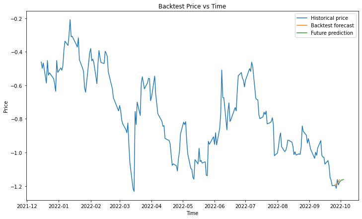
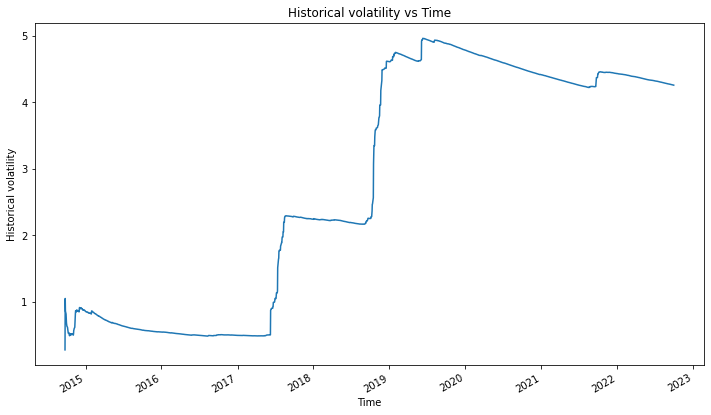
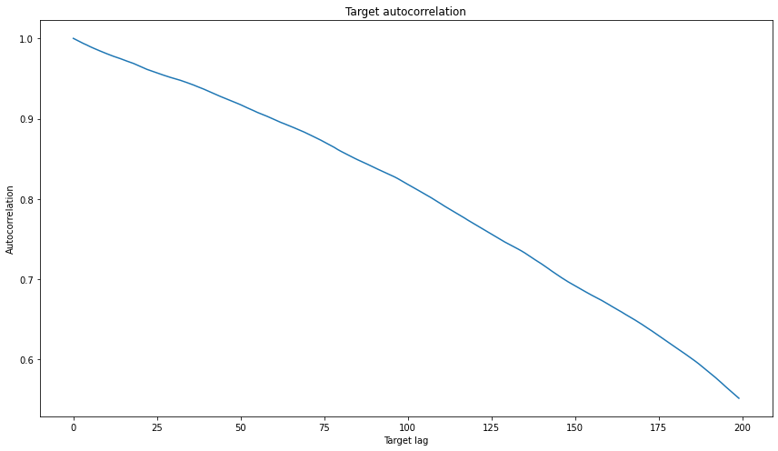

# Basic EDA and backtesting


```python
# Import our classes
from backtesting import *
from features import *
```


```python
# Create backtest
bt = Backtest(asset = "stock", asset_id = "BABA", target="Close", period="max", days_to_pred = 5, num_lag_features = 20, historical_start_idx=200)
# Plot historical stock price
bt.plot_historical()
# Plot prediction on same plot as historical price for visual comparison
bt.plot_backtest()
# Plot future prediction on same plot
bt.plot_future_prediction()
# Call plt.show()
bt.plot_all()
# Print MSE on test set
bt.score()
```


    

    


    MSE is 0.024216191781786987


```python
# Compute Value-at-Risk
v = VaR(bt.price)
v.get_single_stock_VaR()
# Plot log change
v.plot_log_change_and_VaR()
```

    Latest 95% VaR is 1.62


    

    


```python
# Compute and plot historical volatility:
vol = Volatility(bt.price)
print("Lastest historical volatility is {:.2f}%".format(vol.get_historical_volatility()))
vol.plot_historical_volatility()
```

    Lastest historical volatility is 3.34%


    

    


```python
# Compute Correlation and autocorrelation
bt.compute_corr()
bt.plot_corr()
bt.compute_autocorr()
bt.plot_autocorr()
```


    

    


    

    


```python
# Build and test covered call portfolio from start_date (default pd.to_datetime("2022-06-06", format="%Y-%m-%d"))
bt.test_systematic_portfolio(start_date = pd.to_datetime("2022-06-06", format="%Y-%m-%d"))
```

    By investing $1563.7300109863281 in BABA using the covered call strategy between 2022-06-06 and 2022-09-30, the portfolio makes $291.9851882604406


```python
# We can compute the implied volatility as follows
print("Implied Volatility is {:.2f}%".format(100*vol.get_implied_volatility(S_0=100, OP_obs=1, K=100, T=30, r=0.05, option_type = "call")))
```

    Implied Volatility is 6.81%


```python

```
